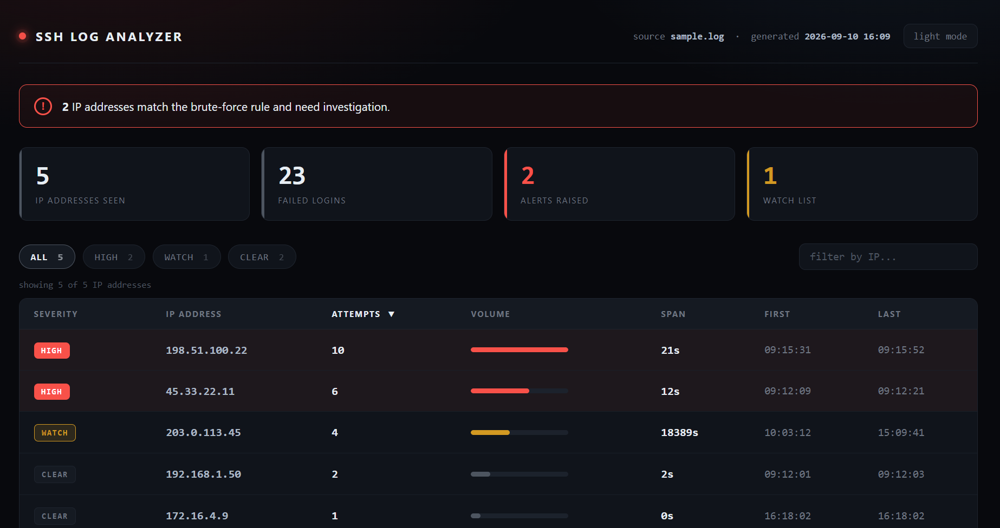

# SSH Log Analyzer

A Python tool that detects SSH brute-force attempts in authentication logs. It
counts failed logins per IP address and raises an alert only when those failures
happen close together in time, which is what separates an automated attack from a
user who mistyped their password.

Output comes in three formats: plain text, JSON, and an interactive HTML
dashboard.



## Usage

```
python analyzer.py sample.log
```

The log file is passed as an argument, so the tool can be pointed at any log
without editing the code.

## What it detects

An alert requires both of the following:

- at least `THRESHOLD` failed attempts (default: 3)
- all of them inside `WINDOW_SECONDS` (default: 60)

Counting failures alone produces false alarms. Three failures across a working
day is usually a person. Ten failures in twenty seconds is a script.

Results are graded into three tiers:

| Tier | Meaning |
|---|---|
| **HIGH** | Meets the threshold and the time window. Treated as an attack. |
| **WATCH** | Meets the threshold, but spread over too long a period to be automated. |
| **CLEAR** | Below the threshold. |

The WATCH tier exists because a plain yes or no alert throws away useful
information. Four failures across five hours is not an attack, but it is worth
noticing.

## Results on the sample data

```
[ALERT] 198.51.100.22 -> 10 failed attempts in 21 seconds - possible brute-force
[ALERT] 45.33.22.11 -> 6 failed attempts in 12 seconds - possible brute-force
203.0.113.45 -> 4 failed attempts
192.168.1.50 -> 2 failed attempts
172.16.4.9 -> 1 failed attempts
```

| IP | Failures | Verdict |
|---|---|---|
| `198.51.100.22` | 10 in 21s | HIGH. Automated, cycling through usernames. |
| `45.33.22.11` | 6 in 12s | HIGH. Automated. |
| `203.0.113.45` | 4 over 5 hours | WATCH. Meets the count, fails the window. |
| `192.168.1.50` | 2 | CLEAR. Below threshold. |
| `172.16.4.9` | 1, then a successful login | CLEAR. Mistyped password. |

`report.json` carries the same findings as structured fields (`ip`,
`failed_attempts`, `span_seconds`, `first_attempt`, `last_attempt`, `alert`), so
the output can be consumed by another tool rather than only read.

## How it works

**Read.** Each line is checked for `Failed`, so successful logins are ignored. The
IP address and timestamp are extracted, and the timestamp is converted to a
`datetime` so it can be used in arithmetic. Each IP is stored in a dictionary
pointing at a list of the times it failed. Storing the times rather than a running
count is what makes the time window possible: a count answers "how many", a list
of times answers "how many" and "how far apart".

The IP is located by finding the word `from` and taking the word after it, rather
than by a fixed word position. This matters because `invalid user` entries contain
two extra words, which shifts where the IP sits in the line.

**Rank.** The IPs are sorted by failure count, most first, so the worst offender
leads every output.

**Write.** The failure count and the seconds between the first and last failure
are calculated per IP, checked against the threshold and the window, and written
to `report.txt`, `report.json` and `report.html`.

The dashboard contains no detection logic. Python injects the findings as JSON and
the page's JavaScript draws the table, the summary cards, the filtering and the
sorting from that data. Detection and presentation stay separate, so restyling the
dashboard never means touching the detector.

## Known limitations

Documented rather than hidden:

- **The window is measured first to last, not as a sliding window.** An IP with a
  fast burst plus one scattered failure hours later would show a large span and be
  missed. A production version would evaluate every group of consecutive failures.
- **The year is taken from the system clock**, because syslog entries do not
  include one. Analysing a December log in January would date every entry a year
  out.
- **The log format is assumed.** Entries are expected to contain `from <ip>`. A
  `Failed` line without the word `from` would raise an error.
- **Timestamps are assumed to be in chronological order.** True of real syslog
  files, but not validated.

## Requirements

Python 3, no external libraries.

`sample.log` is fabricated and uses address ranges reserved for documentation and
private networks (`198.51.100.0/24`, `203.0.113.0/24`, `192.168.0.0/16`,
`172.16.0.0/12`), so no real host is implicated.